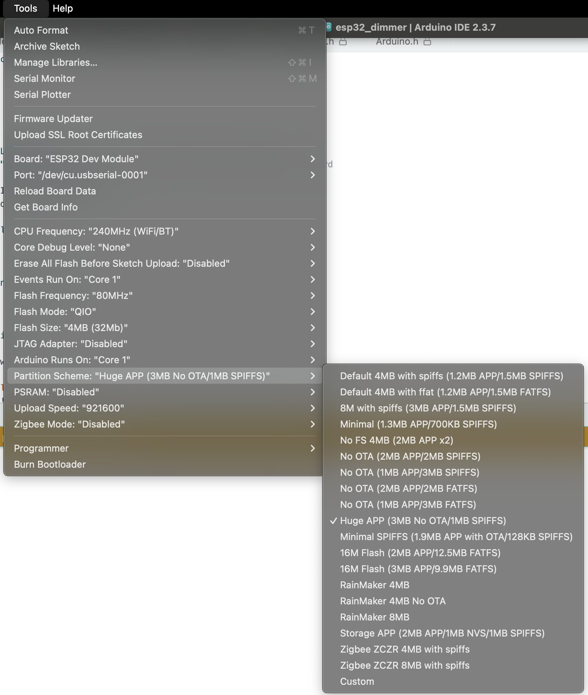

# ESP32 Matter Dimmer

This is my implementation of a Matter PWM dimmer for ESP32 Devkit V1. Developed using Arduino IDE with [Espressif's ESP32 extension](https://raw.githubusercontent.com/espressif/arduino-esp32/gh-pages/package_esp32_index.json).

This projects uses [Espressif's Matter API](https://docs.espressif.com/projects/arduino-esp32/en/latest/libraries.html#matter-apis) 

## How to configure

You can change the following variables:

* `ssid` - change it to your WiFi network SSID (name)
* `password` - change it to your WiFi passowrd
* `ledPin` - ESP32 pin that you want to use as a PWM dimmer (MOSFET gate signal)
* `dimCurve` - smooth dimming curve ratio (1.0 - linear, lower - less dim, higher - more dim)
* `dimDelay` - speed of smooth fade (lower = faster) 

## How to flash

In Arduino IDE select board "ESP32 Dev Module" and change partition scheme to "Huge APP (3MB No OTA/1MB SPIFFS)".

## How to pair

Check the serial monitor (115200 baud) for Matter pairing code
